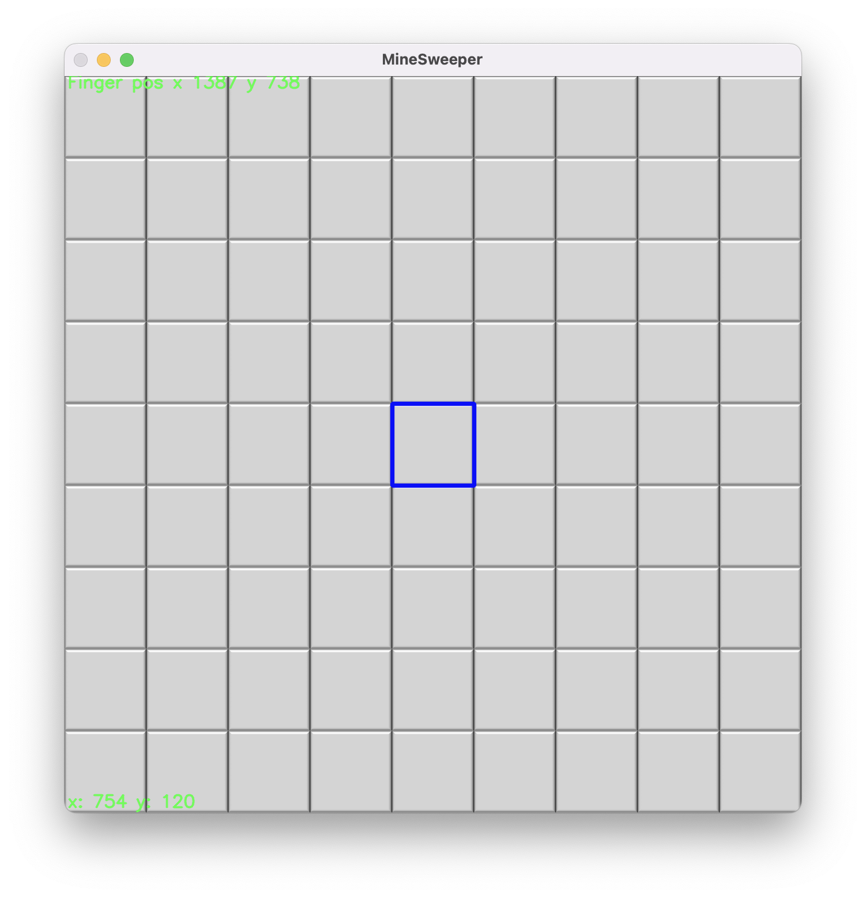
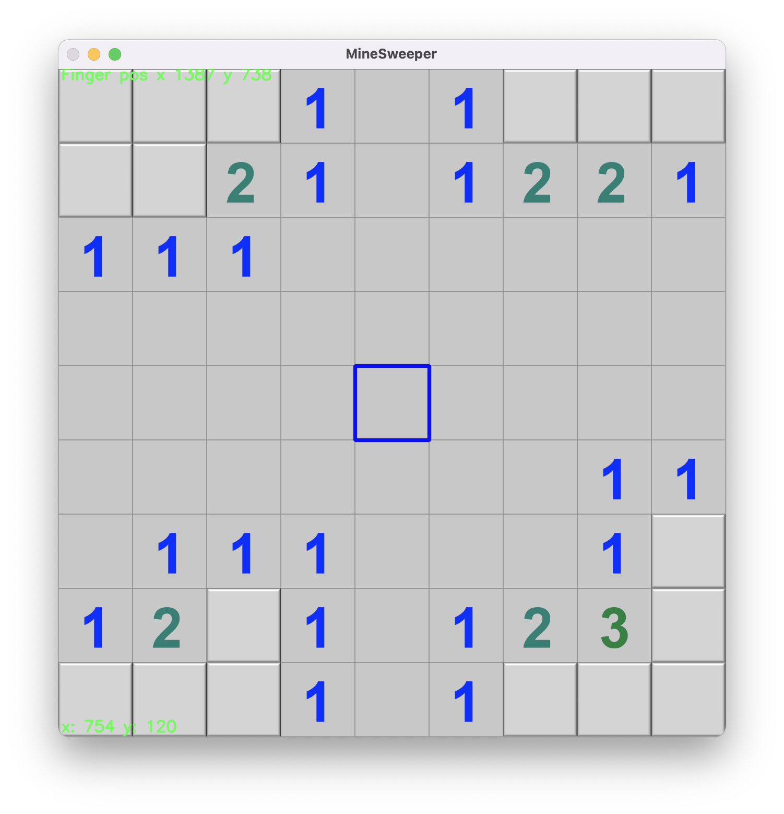
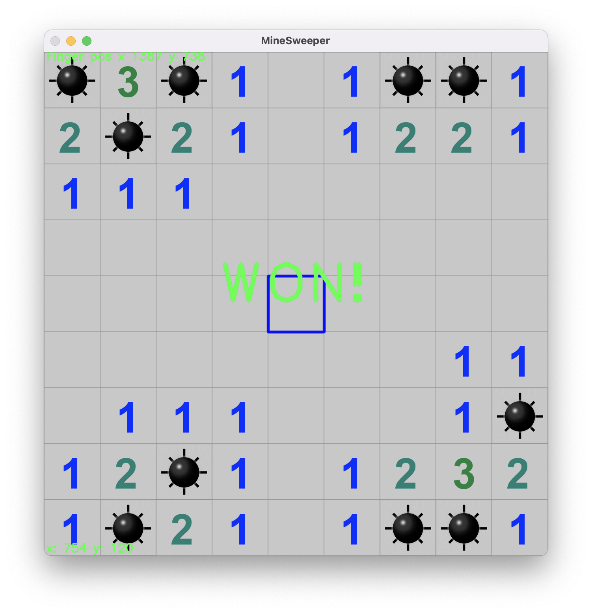

# Play Minesweeper with Hand

Minesweeper is a classic game that is easy to implement from scratch. It has a relatively simple logic and gameplay flow. Only two actions are needed for the game, one is to click on a masked cell while strategically avoiding the hidden mines and the other is to flag a masked cell that you determine to hide a mine so that it cannot be clicked on accidently. The player wins the game once all the cells not containing mines have been revealed or loses it if he/she clicks on a mine. 

With this project, I want to introduce hand gestures into this game. There are basically three actions required from the hand gesture recognition. 

1. Navigation from cell to cell. This can be realized in two ways. One is to track the position of the index finger and the other is to use four gestures to move the focus in up/down/left/right directions, like how one would control an RC or a drone. I chose the first method as it is very easy to set up without additional ML trainings. The selected cell is highlighted with a blue box. The box follows my index finger fairly responsively. I will add the directional control in the future.
2. Click on a cell. Both this action and the action below require gesture recognition. 
3. Flag a cell.

---
A few screenshots of the game are shown below.

